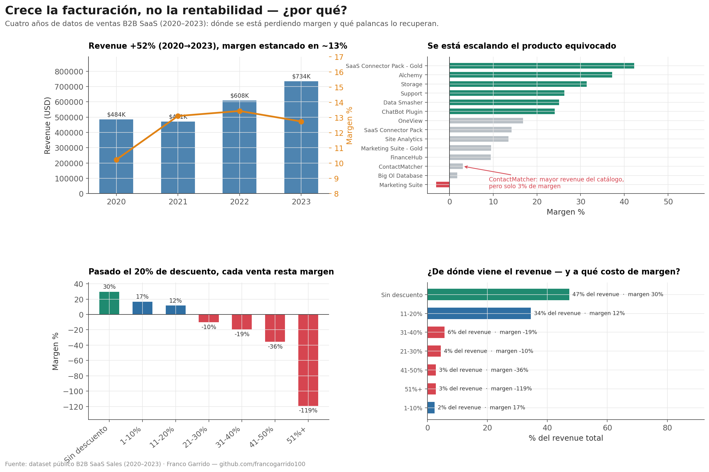

# SaaS Unit Economics Analysis — Profitability & Discount Impact

> **The business was generating $2.3M in revenue with a 12.5% net margin — but 18.7% of transactions were losing money.** This analysis identifies exactly why, and what to do about it.

---

## The Business Problem

A B2B SaaS company had 4 years of transaction data across 3 global regions (EMEA, AMER, APJ), 14 products, and 101 customers — but no clear picture of which products, segments, and discount levels were actually profitable.

The goal: turn raw sales data into actionable decisions on pricing, discounting, and customer strategy.

---

## 📊 Live Dashboard

Results were connected to **Google Looker Studio** for an executive-level, decision-ready view: **[Open the live dashboard](https://datastudio.google.com/s/iV86ADL2rvM)**

---

## Key Findings

**1. Discounts above 30% systematically destroy margin**

Every discount tier above 30% produces a negative average profit margin. At 70% discount, the average margin collapses to -98.7%. Yet 1,160 transactions (11.6% of all orders) were placed in this zone — representing a recoverable margin leak estimated at $50K–$100K per year.

**2. Revenue is dangerously concentrated**

The median transaction value is $54.49 — but the average is $229.86. That 4x gap signals extreme skew: a small number of large deals is carrying most of the revenue. The top 25% of transactions generate the vast majority of total sales. Losing 5 key accounts could collapse the business.

**3. Not all products are equal**

`Alchemy` and `SaaS Connector Pack - Gold` lead in profit margin (37–42%). `ContactMatcher` — the highest-revenue product — delivers only 3% margin. `Marketing Suite` is outright loss-making. The company is scaling the wrong products.

**4. APJ region is underperforming**

APJ accounts for 21% of orders but only 4% of total profit ($11.5K vs. $147K in EMEA). Either pricing, product mix, or cost structure in that region needs a full audit.

**5. SMB outperforms Enterprise on lifetime value**

Counterintuitively, SMB customers have the highest average LTV ($12,097) vs. Enterprise ($5,653) — they buy more frequently and sustain the business more reliably.

---

## Recommendations Delivered

| # | Action | Expected Impact |
|---|--------|-----------------|
| 1 | Cap discounts at 15% for SMB, 25% for Strategic — require approval above threshold | Recover $50K–$100K in annual margin |
| 2 | Launch account protection program for top 10% of customers by LTV | Protect disproportionate share of total revenue |
| 3 | Reallocate sales focus toward high-margin products (Alchemy, Data Smasher, Site Analytics) | Improve blended margin without touching revenue |
| 4 | Audit APJ region pricing and product mix | Bring APJ margin in line with AMER/EMEA |
| 5 | Double down on SMB acquisition over Enterprise | Higher LTV, more consistent purchasing behavior |

---

## What's in This Repository

```
├── saas.ipynb                    # Full analysis notebook
├── unit_economics_results.xlsx   # Exportable results (5 sheets)
├── analysis_report.html          # Interactive HTML dashboard
├── AI Data Analysis Report.pdf   # Executive summary with recommendations
└── SaaS-Sales.csv                # Source dataset (9,994 transactions, 2020–2023)
```

Dataset: [AWS SaaS Sales (Kaggle)](https://www.kaggle.com/datasets/nnthanh101/aws-saas-sales)

---

## Dashboard Preview



*Revenue vs. margin trend, product profitability ranking, and discount impact — each panel framed around a decision, not just a metric.*

---

## Stack

| Tool | Purpose |
|------|---------|
| Python (pandas, matplotlib, seaborn) | Data wrangling and visualization |
| Jupyter Notebook | Exploratory analysis |
| Excel (openpyxl) | Stakeholder-ready output |
| Looker Studio | Executive-level interactive dashboard |

---

## About This Project

This is a portfolio project built on a public B2B SaaS dataset. The analysis approach — unit economics by segment, LTV calculation, discount impact modeling — mirrors what I deliver for real clients.

**If your business has sales data sitting in a spreadsheet and you're not sure what's working:** [let's talk](https://www.upwork.com/freelancers/~01464eeecfaee2a8a5).

---

*Franco Garrido · Economista especializado en analítica de negocio · [GitHub](https://github.com/francogarrido100) · [LinkedIn](https://www.linkedin.com/in/franco-garrido) · [Upwork](https://www.upwork.com/freelancers/~01464eeecfaee2a8a5)*
